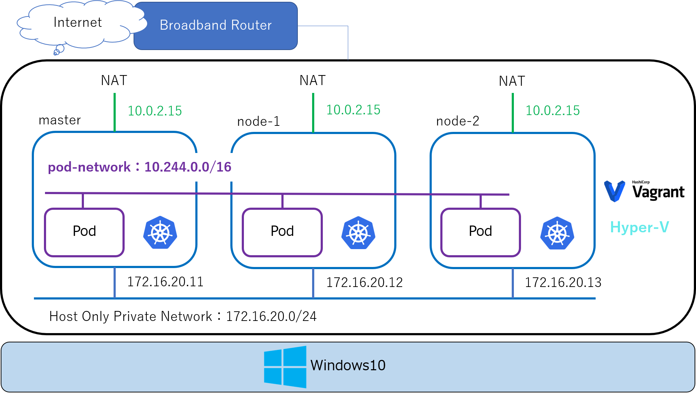

# kube-setting
Kubernetesの本格的な使用方法で構築する
参考サイト：[KubernetesをVagrantで構築](https://qiita.com/MahoTakara/items/28cd766d0447140b7ae3)

## 構成図

## 役割
### master
- yamlファイルの実行先

### work-node
- masterで実行されたyamlに乗っ取って、pod等が作成される場所
- 冗長化するためにnodeは最低限2つは用意する
