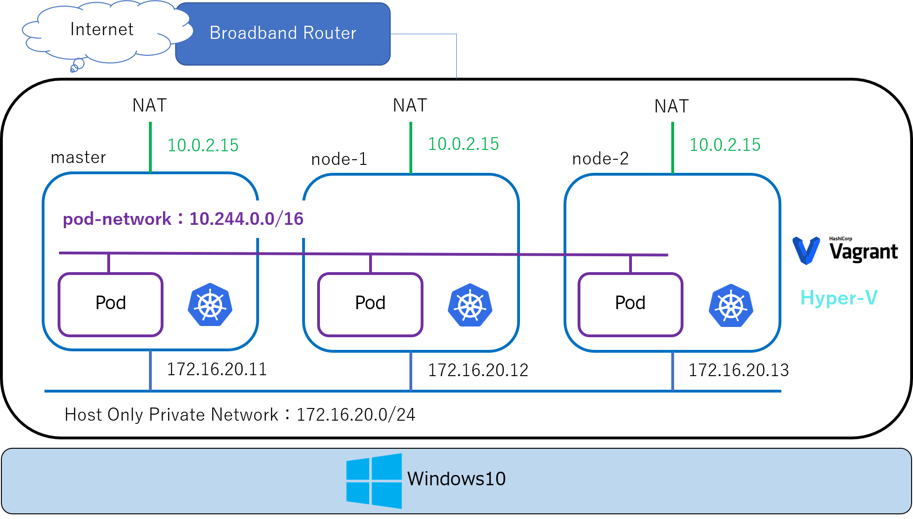

# 将来的な取り組み
- 使用する台数を増やし、本格的な稼働体制にする
- 参考サイト：[KubernetesをVagrantで構築](https://qiita.com/MahoTakara/items/28cd766d0447140b7ae3)

## 構成図

図ではhyper-vであったが、面倒くさすぎる 
無難にVirtualbox使ったほうがまし

## 役割
### master
- yamlファイルの実行先

### work-node
- masterで実行されたyamlに乗っ取って、pod等が作成される場所
- 冗長化するためにnodeは最低限2つは用意する
